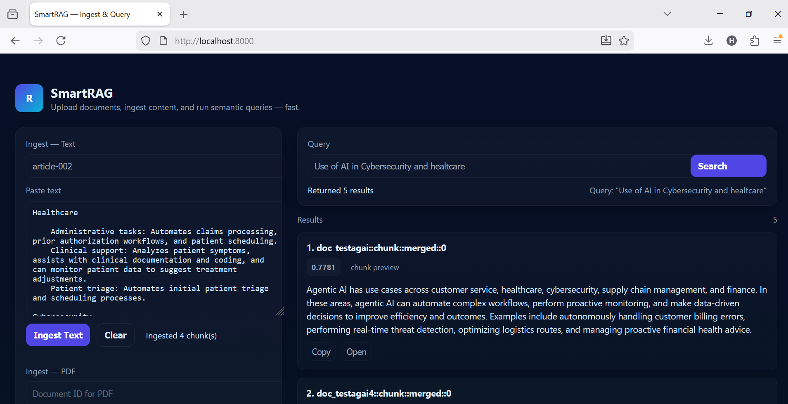

# 🧠 SmartRAG

<div align="center">

**Semantic Chunking + FAISS Vector Search + Azure OpenAI + FastAPI + Modern UI**

[](https://www.python.org/downloads/)
[](https://fastapi.tiangolo.com/)
[](LICENSE)
[](https://github.com/facebookresearch/faiss)
[](https://azure.microsoft.com/en-us/products/ai-services/openai-service)

*A complete, production-ready Retrieval-Augmented Generation (RAG) system built from scratch*

[Features](#-features) • [Quick Start](#-quick-start) • [Architecture](#-architecture) • [API Documentation](#-api-documentation) • [Contributing](#-contributing)

</div>

---

## 📖 Overview

**SmartRAG** is a modular, enterprise-grade RAG system that combines semantic chunking with advanced vector search to provide accurate, context-aware document retrieval for AI applications.

### Why SmartRAG?

Traditional document chunking methods use fixed-size windows that often:
- ❌ Break paragraphs mid-sentence
- ❌ Mix unrelated topics
- ❌ Reduce retrieval accuracy

**SmartRAG solves this** by using semantic chunking that:
- ✅ Respects natural document structure
- ✅ Groups related content intelligently
- ✅ Maximizes retrieval relevance

### 🎯 Ideal For

- 🔍 **Semantic Search** over complex PDFs and text-heavy documents
- 🧠 **RAG Pipelines** for LLMs (GPT-4, GPT-4o, Claude, etc.)
- 📄 **Contextual Q&A** systems
- 🤖 **Enterprise Document Indexing**
- 📚 **Knowledge Base Creation**
- 🧪 **Learning Advanced RAG Techniques**

---

## ✨ Features

### 🎯 Semantic Chunking Engine
- Sentence-level splitting with embedding-based similarity
- Intelligent grouping of related content
- Semantic boundary detection
- Optimized chunk sizes for LLM context windows

### 🚀 High-Performance Vector Search
- **FAISS HNSW** index for lightning-fast ANN search
- Scalable to millions of documents
- L2-normalized embeddings for cosine similarity
- Explicit ID mapping (faiss_idx → chunk_id)

### 🔐 Azure OpenAI Integration
- Support for `text-embedding-3-large` and custom deployments
- Batch embedding processing
- Robust error handling and retries
- Production-ready configuration

### 💾 SQLite Metadata Store
- Lightweight and portable
- Document and chunk metadata management
- Embedding storage
- FAISS index mapping
- Perfect for development and small-to-medium deployments

### 🌐 FastAPI Backend
- **RESTful API** with automatic OpenAPI documentation
- `/ingest` - Upload PDFs or raw text
- `/query` - Semantic search with top-k results
- `/health` - Service health monitoring
- Built-in request validation

### 🎨 Modern Web Interface
- Professional, responsive UI
- Drag-and-drop PDF upload
- Text input support
- Real-time search results
- Chunk preview with relevance scores
- Copy-to-clipboard functionality

---

## 🏗️ Architecture

```
┌─────────────────────────────────────────────────────────┐
│                      Web UI (index.html)                 │
└─────────────────────────────────────────────────────────┘
                            ↓
┌─────────────────────────────────────────────────────────┐
│                    FastAPI Backend (api.py)              │
├─────────────────────────────────────────────────────────┤
│  POST /ingest  │  POST /query  │  GET /health           │
└─────────────────────────────────────────────────────────┘
                            ↓
        ┌───────────────────┴───────────────────┐
        ↓                                       ↓
┌───────────────────┐                 ┌──────────────────┐
│  Semantic Chunker │                 │  Azure OpenAI    │
│   (chunker.py)    │ ←──────────────→│  (embeddings.py) │
└───────────────────┘                 └──────────────────┘
        ↓                                       ↓
┌───────────────────┐                 ┌──────────────────┐
│  SQLite Metadata  │ ←──────────────→│  FAISS Index     │
│    (store.py)     │                 │(vector_index.py) │
└───────────────────┘                 └──────────────────┘
```
---
## 📸 Screenshots
### Ingest Interface

---

## 🚀 Quick Start

### Prerequisites

- Python 3.8 or higher
- Azure OpenAI API access
- pip package manager

### Installation

```bash
# Clone the repository
git clone https://github.com/harshv2013/RAG_SmartAI.git
cd RAG_SmartAI

# Create and activate virtual environment
python -m venv venv2

# Windows
venv2\Scripts\activate

# Mac/Linux
source venv2/bin/activate

# Install dependencies
pip install -r requirements.txt
```

### Configuration

Create a `.env` file in the project root:

```env
AZURE_OPENAI_KEY=your-azure-openai-key
AZURE_OPENAI_ENDPOINT=https://your-endpoint.openai.azure.com/
OPENAI_DEPLOYMENT_NAME=text-embedding-3-large
DB_PATH=chunks_meta.db
FAISS_PATH=faiss.index
```

### Running the Application

```bash
# Start the FastAPI server
uvicorn src.api:app --reload --host 0.0.0.0 --port 8000

# Access the web interface
# Open your browser to: http://127.0.0.1:8000/
```

### Optional: Initialize Database

```bash
python scripts/init_db.py
```

### Optional: Rebuild FAISS Index

```bash
python scripts/rebuild_faiss.py
```

---

## 📁 Project Structure

```
RAG_SmartAI/
├── src/
│   ├── api.py              # FastAPI routes and endpoints
│   ├── chunker.py          # Semantic chunking implementation
│   ├── embeddings.py       # Azure OpenAI embedding wrapper
│   ├── ingest.py           # Document ingestion pipeline
│   ├── store.py            # SQLite metadata management
│   ├── utils.py            # Tokenizer and utilities
│   └── vector_index.py     # FAISS index operations
│
├── static/
│   └── index.html          # Web UI interface
│
├── scripts/
│   ├── init_db.py          # Database initialization
│   └── rebuild_faiss.py    # FAISS index rebuilder
│
├── requirements.txt        # Python dependencies
├── .env.example           # Environment variables template
├── .gitignore             # Git ignore rules
└── README.md              # This file
```

---

## 🔌 API Documentation

### Health Check

**GET** `/health`

```bash
curl http://127.0.0.1:8000/health
```

**Response:**
```json
{
  "status": "healthy"
}
```

### Ingest Document

**POST** `/ingest`

Upload a PDF or ingest raw text for semantic chunking and indexing.

**Request (Text):**
```bash
curl -X POST "http://127.0.0.1:8000/ingest" \
  -H "Content-Type: application/json" \
  -d '{
    "doc_id": "doc1",
    "text": "Transformers revolutionized NLP by introducing self-attention mechanisms..."
  }'
```

**Request (PDF):**
```bash
curl -X POST "http://127.0.0.1:8000/ingest" \
  -F "file=@document.pdf" \
  -F "doc_id=doc2"
```

**Response:**
```json
{
  "status": "success",
  "doc_id": "doc1",
  "chunks_created": 15
}
```

### Query Documents

**POST** `/query`

Retrieve the top-k most relevant chunks for a given query.

**Request:**
```bash
curl -X POST "http://127.0.0.1:8000/query" \
  -H "Content-Type: application/json" \
  -d '{
    "query": "What are transformers in NLP?",
    "k": 3
  }'
```

**Response:**
```json
{
  "results": [
    {
      "chunk_id": "chunk_001",
      "doc_id": "doc1",
      "text": "Transformers are neural network architectures...",
      "score": 0.92,
      "metadata": {}
    }
  ]
}
```

### Interactive API Documentation

Once the server is running, visit:
- **Swagger UI:** http://127.0.0.1:8000/docs
- **ReDoc:** http://127.0.0.1:8000/redoc

---

## 🧪 Use Cases

### Enterprise Applications
- Legal document retrieval systems
- Medical literature search
- Financial report analysis
- Customer support knowledge bases

### AI-Powered Products
- Chat-with-your-PDF applications
- Intelligent documentation systems
- Research paper exploration tools
- Compliance and audit systems

### Learning & Development
- Understanding RAG architecture
- Experimenting with semantic search
- Building custom LLM applications
- Prototyping AI features

---

## 🔒 Security Best Practices

- ⚠️ **Never commit `.env` files** - Contains sensitive API keys
- ⚠️ **Add `.gitignore`** - Exclude embeddings DB and FAISS index
- ⚠️ **Use environment variables** - For all configuration
- ⚠️ **Implement authentication** - Add API key validation for production
- ⚠️ **Enable HTTPS** - Use SSL/TLS in production deployments
- ⚠️ **Rate limiting** - Protect against abuse

---

## 🛠️ Advanced Configuration

### Custom Chunking Parameters

Edit `src/chunker.py` to adjust:
- `similarity_threshold` - Controls chunk boundary detection
- `max_chunk_size` - Maximum tokens per chunk
- `min_chunk_size` - Minimum tokens per chunk

### FAISS Index Types

SmartRAG uses HNSW by default. For alternative indices, modify `src/vector_index.py`:
- **Flat** - Exact search (small datasets)
- **IVF** - Inverted file index (large datasets)
- **HNSW** - Hierarchical navigable small world (balanced)

### Embedding Models

Supported Azure OpenAI models:
- `text-embedding-3-large` (Recommended)
- `text-embedding-3-small`
- `text-embedding-ada-002`
- Custom deployment names

---

## 🤝 Contributing

Contributions are welcome! Here are some ideas:

### Enhancement Ideas
- 🔄 Multi-document batch ingestion
- 🎯 Reranker model integration
- 🔀 Hybrid search (BM25 + embeddings)
- 🌊 Streaming UI updates
- 📝 LLM-powered summarization
- 🔍 Advanced filtering options
- 📊 Analytics dashboard

### How to Contribute

1. Fork the repository
2. Create a feature branch (`git checkout -b feature/AmazingFeature`)
3. Commit your changes (`git commit -m 'Add some AmazingFeature'`)
4. Push to the branch (`git push origin feature/AmazingFeature`)
5. Open a Pull Request

---

## 📝 License

This project is licensed under the MIT License - see the [LICENSE](LICENSE) file for details.

---

## 🙏 Acknowledgments

- **FAISS** - Facebook AI Similarity Search
- **FastAPI** - Modern web framework for Python
- **Azure OpenAI** - Enterprise-grade AI services
- **Sentence Transformers** - Semantic similarity models

---

## 📧 Contact & Support

- 📮 **Issues:** [GitHub Issues](https://github.com/harshv2013/RAG_SmartAI/issues)
- 💬 **Discussions:** [GitHub Discussions](https://github.com/harshv2013/RAG_SmartAI/discussions)
- 📧 **Email:** harsh2013@gmail.com
- 💼 **LinkedIn**: https://www.linkedin.com/in/harsh-vardhan-60b6aa106/

---

<div align="center">

**Built with ❤️ for the AI community**

⭐ Star this repo if you find it useful! ⭐

</div>